# ThingSpace Device Usage Processing - Technical Analysis (Revised)

## 1. Who publishes the initial SQS message for usage processing?

**Answer:** The `AltaworxThingSpaceAWSGetDevices` lambda function publishes the initial SQS messages for usage processing through a self-triggering mechanism.

### Flow Process:

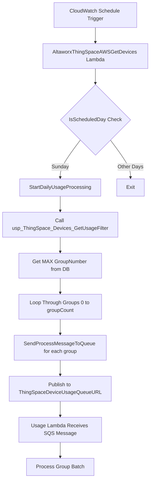

### Detailed Process Flow:

1. **Scheduled Trigger**: CloudWatch triggers the lambda based on schedule
2. **Day Check**: `IsScheduledDay()` method validates if it's Sunday (lines 100-105)
3. **Initialization**: When `InitializeProcessing = true`, calls `StartDailyUsageProcessing()` (line 75)
4. **Database Setup**: Executes stored procedure `usp_ThingSpace_Devices_GetUsageFilter` (line 123)
5. **Group Calculation**: Queries database for `MAX(GroupNumber)` (lines 142-143)
6. **Message Publishing**: Loops through groups and publishes SQS messages (lines 446-452)

### Code Reference:
```csharp
// Lines 446-452: Publishing multiple group messages
for (int iGroup = 0; iGroup <= groupCount; iGroup++)
{
    SendProcessMessageToQueue(context, iGroup, serviceProviderId, 30);
}

// Lines 454-507: SendProcessMessageToQueue implementation
private void SendProcessMessageToQueue(KeySysLambdaContext context, int groupNumber, int serviceProviderId, int delaySeconds)
{
    var sqsValues = new GetDeviceUsageSqsValues(false, groupNumber, serviceProviderId);
    var message = JsonConvert.SerializeObject(sqsValues);
    // ... SQS publishing logic
}
```

### Message Structure Flow:
```csharp
public class GetDeviceUsageSqsValues
{
    public bool InitializeProcessing { get; private set; }      // false for group messages
    public int GroupNumber { get; private set; }               // 0 to groupCount
    public int ServiceProviderId { get; private set; }         // Target service provider
    public List<string> DevicesProcessed { get; private set; } // Tracking processed devices
    public Dictionary<int, BillingPeriod> BillingPeriods { get; private set; } // Billing periods cache
}
```

---

## 2. What is the batch size/grouping logic for ICCIDs in usage flow?

**Answer:** The batch size is configurable via environment variable, and ICCIDs are grouped using a database-driven grouping mechanism with a stored procedure.

### Flow Process:

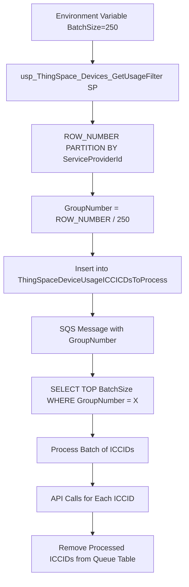

### Detailed Process Flow:

1. **Configuration**: `BatchSize = 250` retrieved from environment (line 38)
2. **Database Grouping**: Stored procedure creates groups using window function
3. **Group Assignment**: Each ICCID gets assigned a `GroupNumber` based on batch size
4. **SQS Processing**: Each message targets specific `GroupNumber`
5. **Batch Retrieval**: Query fetches up to `BatchSize` ICCIDs for the group
6. **Sequential Processing**: Each ICCID processed individually within batch
7. **Cleanup**: Processed ICCIDs removed from processing table

### Code Reference:
```csharp
// Lines 169, 176-180: Batch processing logic
List<ThingSpaceICCIDtoProcess> iccids = new List<ThingSpaceICCIDtoProcess>(BatchSize);
string cmdText = $@"SELECT TOP {BatchSize} [ICCID], [ServiceProviderId], [BillingCycleEndDate] 
                   FROM [dbo].[ThingSpaceDeviceUsageICCICDsToProcess] 
                   WHERE ServiceProviderId = @ServiceProviderId AND GroupNumber = {sqsValues.GroupNumber}";

// Lines 190-205: ICCID retrieval and processing setup
using (var command = new SqlCommand(cmdText, connection))
{
    command.Parameters.AddWithValue("@ServiceProviderId", sqsValues.ServiceProviderId);
    using (var reader = command.ExecuteReader())
    {
        while (reader.Read())
        {
            iccids.Add(new ThingSpaceICCIDtoProcess
            {
                iccid = reader["ICCID"].ToString(),
                serviceProviderId = Convert.ToInt32(reader["ServiceProviderId"]),
                billingCycleEndDate = Convert.ToDateTime(reader["BillingCycleEndDate"])
            });
        }
    }
}
```

### Database Stored Procedure Logic:
```sql
-- Groups devices into batches of 250 using ROW_NUMBER() window function
SELECT 
    dev.ICCID,
    dev.ServiceProviderId,
    dev.BillingCycleEndDate,
    (ROW_NUMBER() OVER(PARTITION BY dev.[ServiceProviderId] ORDER BY dev.id) - 1) / 250 AS GroupNumber
FROM DeviceTable dev
WHERE dev.IsActive = 1
```

---

## 3. Confirm ThingSpace API endpoints for GetThingSpaceUsageAsync and GetThingSpaceDailyUsageAsync

**Answer:** Both methods use the same ThingSpace API endpoint but with different date ranges and are implemented in `ThingSpaceDeviceDetailService`.

### Flow Process:

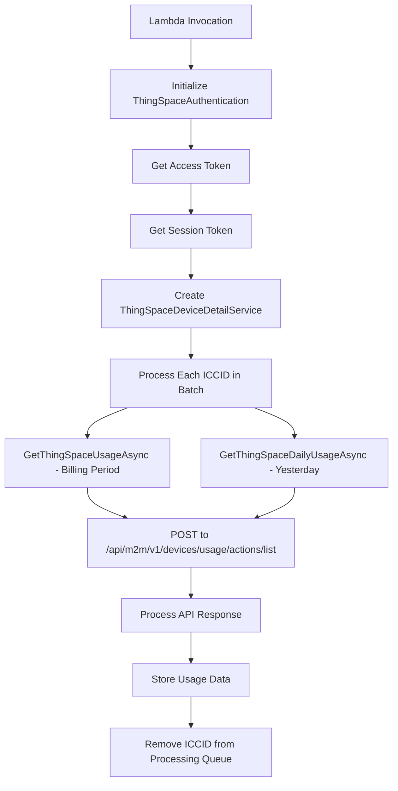

### Authentication Flow Process:

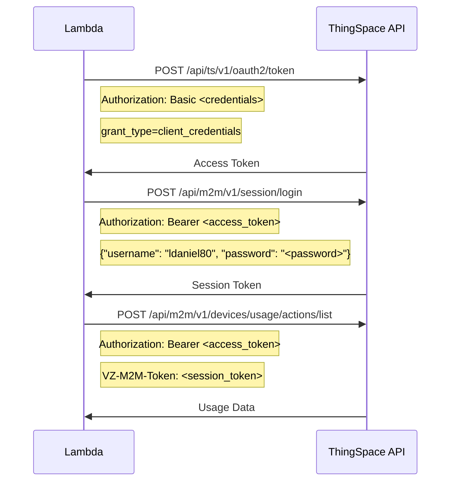

### API Configuration Details:

- **API Endpoint:** `ThingSpaceDeviceUsageGetURL = "/api/m2m/v1/devices/usage/actions/list"` (environment variable)
- **Base URL:** `https://thingspace.verizon.com/` (from ThingSpaceAuthentication)
- **Full URL Construction:** `{_thingSpaceAuthentication.BaseUrl.TrimEnd('/')}{thingSpaceDeviceUsageGetURL}` (lines 99, 147)
- **HTTP Method:** POST

### Request Headers Flow:
```csharp
// Authentication setup in constructor (lines 51-58)
_httpClient.DefaultRequestHeaders.Clear();
_httpClient.DefaultRequestHeaders.Add("accept", "application/json");
_httpClient.DefaultRequestHeaders.Add("Authorization", $"Bearer {accessToken}");
_httpClient.DefaultRequestHeaders.Add("VZ-M2M-Token", sessionToken);
```

### API Request Structure and Date Logic:
```csharp
// GetThingSpaceUsageAsync (lines 101-103) - Billing cycle period
DateTime earliestDate = iccidToProcess.billingCycleEndDate.AddMonths(-1).AddMinutes(1);
string earliestDateStr = earliestDate.ToString("s", System.Globalization.DateTimeFormatInfo.InvariantInfo) + "Z";
string latestDateStr = iccidToProcess.billingCycleEndDate.ToString("s", System.Globalization.DateTimeFormatInfo.InvariantInfo) + "Z";

// GetThingSpaceDailyUsageAsync (line 242) - Single day (yesterday)
string usageDateStr = usageDate.ToString("s", System.Globalization.DateTimeFormatInfo.InvariantInfo) + "Z";

// Request payload structure
var requestPayload = new
{
    deviceId = new
    {
        id = iccidToProcess.iccid,
        kind = "iccid"
    },
    earliest = earliestDateStr,
    latest = latestDateStr
};
```

### Date Range Processing Logic:
- **GetThingSpaceUsageAsync:** 
  - Start: `billingCycleEndDate.AddMonths(-1).AddMinutes(1)` (beginning of billing cycle + 1 minute)
  - End: `billingCycleEndDate` (end of billing cycle)
  - Purpose: Full billing period usage data
  
- **GetThingSpaceDailyUsageAsync:** 
  - Start/End: Same date (yesterday's date)
  - Purpose: Daily usage snapshot for specific date

---

## 4. How are billing periods determined if API data is incomplete?

**Answer:** Billing periods are determined using a hierarchical fallback system with database configuration and system defaults, implemented across multiple helper classes.

### Flow Process:

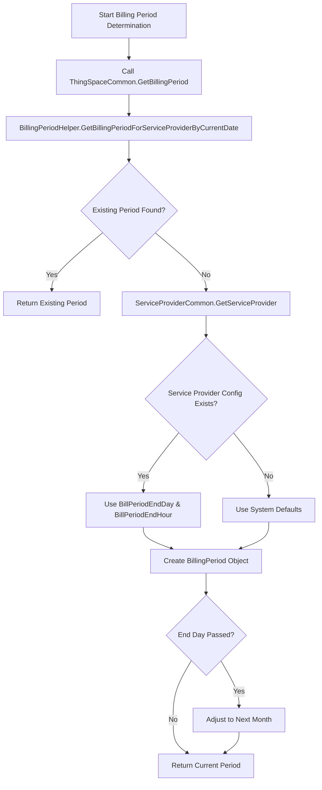

### Detailed Process Flow:

1. **Primary Lookup**: Check for existing billing period in database using current date
2. **Service Provider Fallback**: Query ServiceProvider table for custom billing configuration
3. **System Defaults**: Apply hardcoded defaults if no configuration exists
4. **Date Adjustment**: Modify billing period if current date has passed the end day
5. **Period Creation**: Construct BillingPeriod object with determined values

### Primary Flow Implementation:
```csharp
// Line 250: Primary billing period retrieval
var billingPeriod = ThingSpaceCommon.GetBillingPeriod(context, iccids[iRow].serviceProviderId, DateTime.UtcNow, TimeZoneInfo.Utc);

// ThingSpaceCommon.cs, lines 344: Primary lookup attempt
var billingPeriod = BillingPeriodHelper.GetBillingPeriodForServiceProviderByCurrentDate(
    centralDbConnectionString, serviceProviderId, currentDateTime, timeZoneInfo);

// Lines 325-327: Fallback to service provider configuration
if (billingPeriod == null)
{
    var serviceProvider = ServiceProviderCommon.GetServiceProvider(centralDbConnectionString, serviceProviderId);
}
```

### Hierarchical Fallback System Flow:

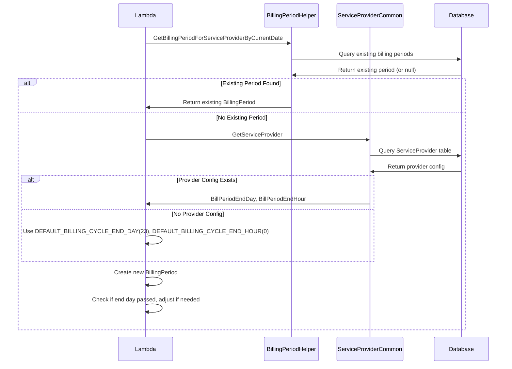

### System Defaults and Fallback Logic:
```csharp
// ThingSpaceCommon.cs, lines 31-32: System defaults
private const int DEFAULT_BILLING_CYCLE_END_DAY = 23;
private const int DEFAULT_BILLING_CYCLE_END_HOUR = 0;

// Lines 330-331: Apply defaults if service provider values are null
var billCycleEndDay = serviceProvider.BillPeriodEndDay ?? DEFAULT_BILLING_CYCLE_END_DAY;
var billCycleEndHour = serviceProvider.BillPeriodEndHour ?? DEFAULT_BILLING_CYCLE_END_HOUR;

// Lines 335-342: Adjust billing period if end day has passed
if (billingPeriod.BillingPeriodEndDay < currentDateTime.Day)
{
    var endDate = billingPeriod.BillingPeriodEnd.AddMonths(1);
    billingPeriodYear = endDate.Year;
    billingPeriodMonth = endDate.Month;
    billingPeriod = new BillingPeriod(0, serviceProviderId, billingPeriodYear, billingPeriodMonth, billCycleEndDay, billCycleEndHour, timeZoneInfo);
}
```

### Database Stored Procedures Flow:
- **Primary:** `dbo.usp_Service_Provider_Get_Bill_Period_Day_And_Hour` (BillingPeriodHelper.cs, line 20)
- **Existing Period Lookup:** `SERVICE_PROVIDER_GET_EXISTING_BILL_PERIOD_BY_CURRENT_DATE_TIME` (BillingPeriodHelper.cs, line 145)

---

## 5. What happens to failed ICCIDs—are they retried automatically, skipped, or logged?

**Answer:** Failed ICCIDs are logged but not automatically retried at the individual ICCID level. The system continues processing remaining ICCIDs in the batch and cleans up failed ICCIDs from the processing queue.

### Flow Process:

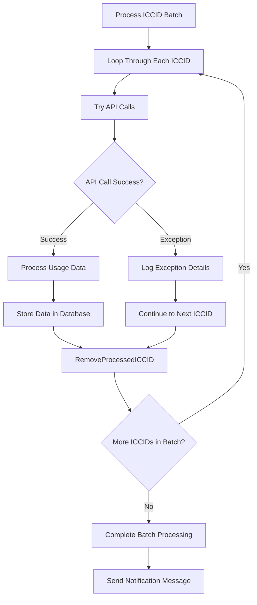

### Error Handling Process Flow:

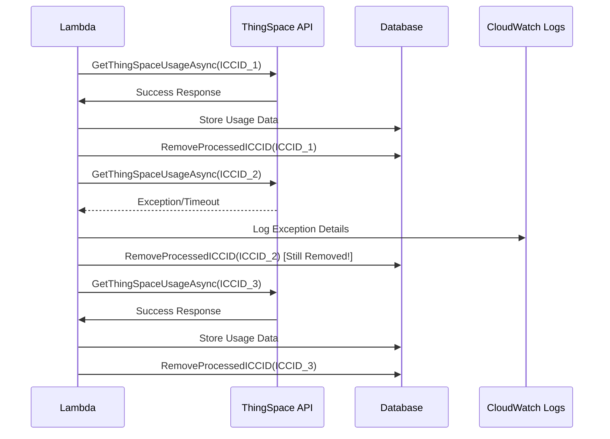

### Error Handling Implementation:
```csharp
// Lines 238-248: Try-catch around API calls
try
{
    deviceUsage = await client.GetThingSpaceUsageAsync(iccids[iRow], sessionToken.sessionToken, accessToken.Access_Token, ThingSpaceDeviceUsageGetURL, context.logger);
    deviceDailyUsage = await client.GetThingSpaceDailyUsageAsync(iccids[iRow], sessionToken.sessionToken, accessToken.Access_Token, ThingSpaceDeviceUsageGetURL, usageDateStr, usageDateStr, context.logger);
}
catch (Exception ex)
{
    LogInfo(context, "EXCEPTION", $"Error Getting Device Usage for {iccids[iRow].iccid}: {JsonConvert.SerializeObject(ex)}");
    // Processing continues - no retry, no break
}

// Lines 308: Cleanup regardless of success/failure
RemoveProcessedICCID(context, iccids[iRow].iccid);
```

### Processing Continuation Logic:
1. **Exception Logging**: Failed ICCID details logged with full exception (line 247)
2. **No Processing Stop**: Exception doesn't break the batch processing loop
3. **Guaranteed Cleanup**: `RemoveProcessedICCID()` called regardless of success/failure (line 308)
4. **No Individual Retry**: Failed ICCIDs are not retried within the same batch
5. **Batch-Level Retry**: Only SQS message retry would reprocess entire batch

### RemoveProcessedICCID Implementation Flow:
```csharp
// Lines 423-443: Cleanup method for processed ICCIDs (including failed ones)
private void RemoveProcessedICCID(KeySysLambdaContext context, string iccid)
{
    using (var connection = new SqlConnection(context.CentralDbConnectionString))
    {
        using (var command = new SqlCommand($"DELETE FROM [dbo].[ThingSpaceDeviceUsageICCICDsToProcess] WHERE [ICCID] = @iccid", connection))
        {
            command.CommandType = CommandType.Text;
            if (!string.IsNullOrWhiteSpace(iccid))
            {
                command.Parameters.AddWithValue("@iccid", iccid);
            }
            else
            {
                command.Parameters.AddWithValue("@iccid", DBNull.Value);
            }

            connection.Open();
            command.ExecuteNonQuery();
        }
    }
}
```

**Key Behavior:** The `RemoveProcessedICCID` method removes the ICCID from the `ThingSpaceDeviceUsageICCICDsToProcess` table regardless of whether the API call succeeded or failed, ensuring that failed ICCIDs are not reprocessed in subsequent batches.

### Retry Strategy Summary:
- **Individual ICCID Level**: No automatic retry
- **Batch Level**: SQS message retry (configured at SQS level)
- **Lambda Level**: AWS Lambda retry for unhandled exceptions
- **HTTP Level**: Polly retry policy (3 attempts) for API calls

---

## 6. Provide retry config (attempts, delays) for Polly HTTP/SQL retries

**Answer:** The system uses Polly for HTTP retries with a fixed 3-attempt configuration, but SQL operations don't have explicit retry policies.

### HTTP Retry Flow Process:

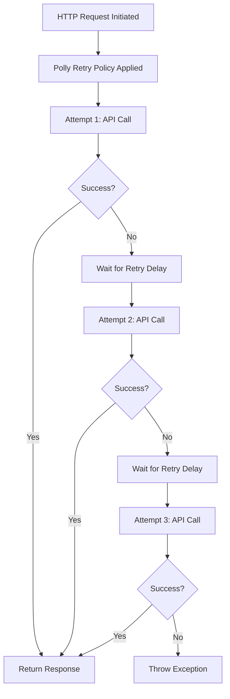

### SQL Operations Flow Process:

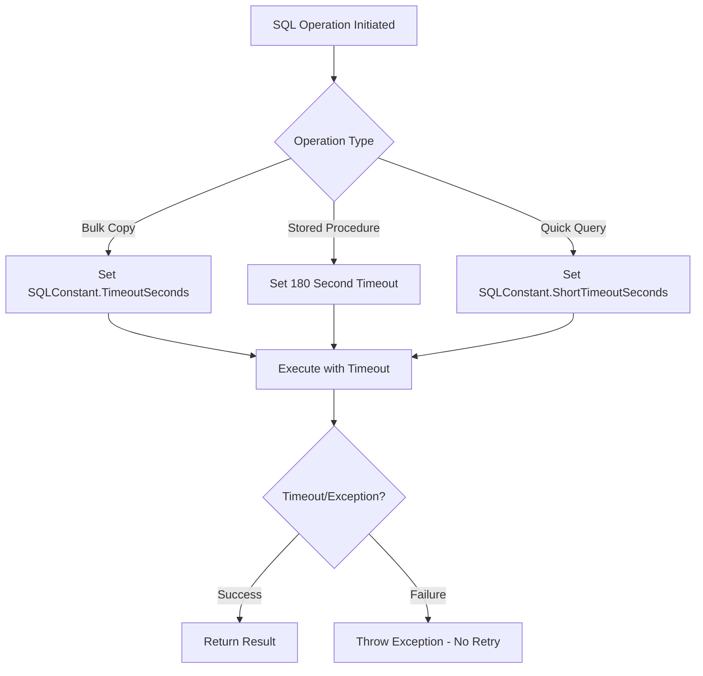

### HTTP Retry Configuration Details:
```csharp
// Lines 400-404: HTTP retry policy setup
private IAsyncPolicy GetHttpRetryPolicy(KeySysLambdaContext context)
{
    var policyFactory = new PolicyFactory(context.logger);
    return policyFactory.GetHttpRetryPolicy(3);  // Fixed 3 attempts
}

// Lines 220-222: Retry policy usage in ThingSpaceDeviceDetailService
var httpRetryPolicy = GetHttpRetryPolicy(context);
var client = new ThingSpaceDeviceDetailService(thingSpaceAuth, new Base64Service(), 
    new Amop.Core.Services.Http.SingletonHttpClientFactory(), httpRetryPolicy, context.logger, 
    new Amop.Core.Services.Http.HttpRequestFactory());
```

### HTTP Retry Configuration Summary:
- **Retry Attempts:** 3 attempts (hardcoded)
- **Implementation:** External `PolicyFactory.GetHttpRetryPolicy(3)` 
- **Scope:** Applies to all ThingSpace API calls
- **Delay Strategy:** Configured in PolicyFactory (external implementation)
- **Applicable Methods:** 
  - `GetThingSpaceUsageAsync`
  - `GetThingSpaceDailyUsageAsync`
  - Authentication calls (access token, session token)

### SQL Timeout Configuration Details:
```csharp
// Line 304: SqlBulkCopy timeout
bulkCopy.BulkCopyTimeout = SQLConstant.TimeoutSeconds;

// Line 414: UpdateDeviceUsage stored procedure timeout
command.CommandTimeout = 180;  // 3 minutes

// BillingPeriodHelper.cs, line 144: Short timeout for billing period queries
command.CommandTimeout = SQLConstant.ShortTimeoutSeconds;
```

### SQL Configuration Summary:
- **No Explicit Retry Policy:** SQL operations don't use Polly retry policies
- **Timeout-Based Failure Handling:** Operations fail after timeout expires
- **Connection Management:** Standard `SqlConnection` with proper disposal
- **Timeout Settings:**
  - **Bulk Operations:** `SQLConstant.TimeoutSeconds` (likely 30-60 seconds)
  - **Stored Procedures:** 180 seconds (3 minutes) for complex operations
  - **Quick Queries:** `SQLConstant.ShortTimeoutSeconds` (likely 10-30 seconds)

### Retry Strategy Implementation Flow:

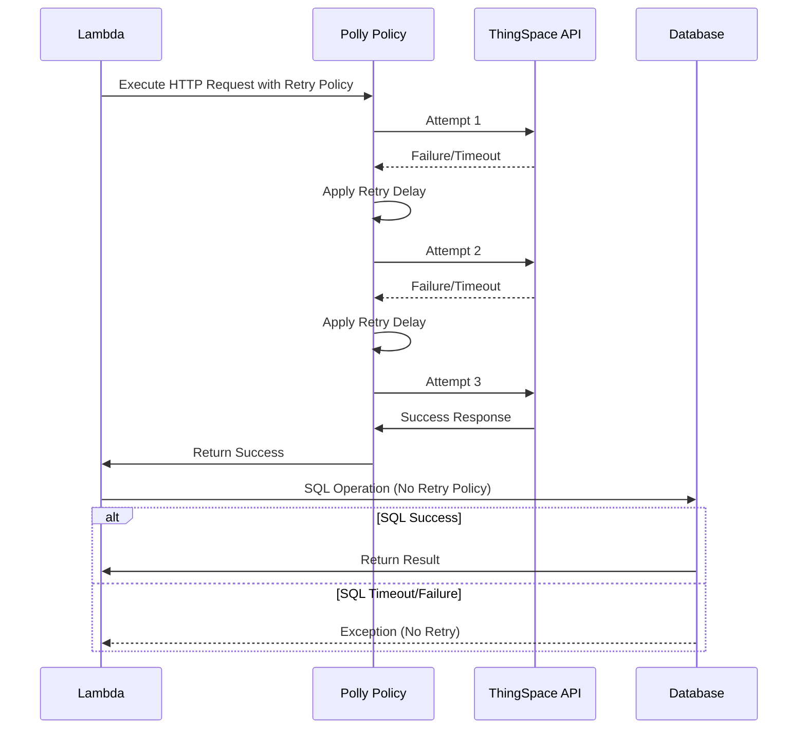

---

## Additional Technical Details

### Complete SQS Message Flow Process:

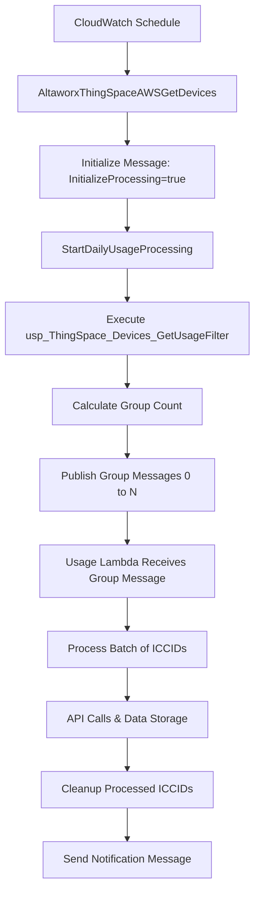

### Database Tables and Their Roles:

1. **ThingSpaceDeviceUsageICCICDsToProcess**
   - **Purpose:** Queue table for ICCIDs to be processed
   - **Key Fields:** ICCID, ServiceProviderId, GroupNumber, BillingCycleEndDate
   - **Lifecycle:** Populated by stored procedure, consumed by usage lambda, cleaned up after processing

2. **ThingSpaceDeviceUsageStaging**
   - **Purpose:** Temporary storage for usage data before final processing
   - **Usage:** Bulk insert via SqlBulkCopy for performance
   - **Processing:** Data moved to final tables via stored procedures

3. **ThingSpaceDeviceDailyUsage**
   - **Purpose:** Stores daily usage snapshots
   - **Update Pattern:** Upsert via stored procedure calls

4. **ServiceProvider**
   - **Purpose:** Configuration table for billing periods
   - **Key Fields:** BillPeriodEndDay, BillPeriodEndHour
   - **Role:** Fallback configuration when no specific billing period exists

### Environment Variables and Configuration:

```csharp
// API Configuration
ThingSpaceDeviceUsageGetURL = "/api/m2m/v1/devices/usage/actions/list"
ThingSpaceDeviceNotificationQueueURL = "https://sqs.us-east-1.amazonaws.com/130265568833/Jasper_Get_Device_Sync_Notification_TEST"
ThingSpaceDeviceUsageQueueURL = "https://sqs.us-east-1.amazonaws.com/130265568833/ThingSpace_Usage_TEST"

// Processing Configuration
BatchSize = 250  // ICCIDs per batch
```

### Performance Optimization Strategies:

1. **Lambda Timeout Management**
   - Check remaining execution time before processing each ICCID (line 232)
   - Stop processing if less than 60 seconds remaining
   - Ensures graceful completion within Lambda limits

2. **Database Performance**
   - Use `SqlBulkCopy` for efficient data insertion (lines 315-320)
   - Batch processing reduces API calls and database connections
   - Proper connection disposal and timeout management

3. **API Efficiency**
   - Reuse authentication tokens across batch
   - HTTP retry policies reduce transient failure impact
   - Single HTTP client instance per batch processing

4. **Memory Management**
   - Pre-sized collections based on BatchSize (line 169)
   - Proper disposal of database connections and HTTP clients
   - Efficient JSON serialization/deserialization

### Error Handling and Monitoring Strategy:

1. **Comprehensive Logging**
   - All exceptions logged with full context and ICCID details
   - Processing milestones logged for monitoring
   - Performance metrics captured for optimization

2. **Graceful Degradation**
   - Individual ICCID failures don't stop batch processing
   - Failed ICCIDs are cleaned up to prevent reprocessing
   - System continues with remaining work

3. **Data Integrity**
   - Database transactions ensure data consistency
   - Failed operations are properly cleaned up
   - No partial data states left in processing tables

4. **Monitoring Points**
   - SQS message processing metrics
   - API call success/failure rates
   - Database operation performance
   - Lambda execution duration and memory usage